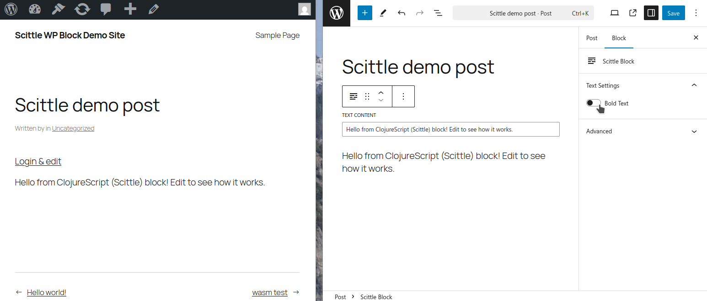

# WordPress Block experiments with different rendering options

## Demo block
Block has text box and toggle toggle controls for user editable content and uses similar template for rendering each variation.
It's controls and rendering look like following:




## Different blocks

Rough overview of current experiments.

| Block name                             | Rendering for web     | Editor controls | Editor preview           | For who / notes                                | Quality      |
|----------------------------------------|-----------------------|-----------------|--------------------------|------------------------------------------------|--------------|
| No Build Block (no-build-test)         | SSR PHP               | Vanilla JS      | SSR PHP                  | Mainstream, migratees from ACF Blocks etc.     | Production   |
| Timber Test Block (timber-test)        | SSR PHP (Twig/Timber) | Vanilla JS      | SSR PHP (Timber/Twig)    | Django templates / Twig / Selmer devs          | Beta         |
| TwigJS Test Block (twigjs-test)        | SSR PHP (Twig/Timber) | Vanilla JS      | Clientside TwigJS        | Isomorphic / Subset of Twig for editor preview | Alpha        |
| Twig Wasm Test Block (twig-wasm-test)  | SSR (Twig)            | Vanilla JS      | Clientside PHP-WASM Twig | Isomorphic / Full Twig in WASM                 | Pre-alpha    |
| Scittle Test Block (scittle-test)      | SSR PHP               | ClojureScript   | Clientside ClojureScript | Scittle / Reagent                              | Alpha        |
| Phel Scittle Block (phel-scittle-test) | SSR PHP (Phel)        | ClojureScript   | SSR PHP (Phel)           | Isomorphic / Uses different hiccup dialects    | Experimental |

### Quality legend

- Production: good to use as is
- Beta: Needs some work but not much
- Alpha: Demo works with some ceveats, needs more work
- Pre-alpha: Needs lot of work, demo in progress
- Experimental: demo does not work yet and might lead to issues

# Running development WordPress installation

Start containers with `docker compose up` and access https://localhost:8080.
Clean WP installation should come up with demo post having Scittle Test Block inserted.
Admin login https://localhost:8080/wp-admin user: admin password: password

# General information
Section is work in progress..
## What is a WordPress block?
Layout snippet with graphical editor user interface in WordPress "Gutenberg" ReactJS editor.

Saved in serialized format in database `wp_posts` table content column:

```
<!-- wp:my-plugin/scittle-block {"textContent":"FOO text here","isBold":true} /-->
```

PHP renders it on server-side for viewers.

- PEG parser grammar https://github.com/WordPress/gutenberg/tree/trunk/packages/block-serialization-spec-parser
- Default linear parser PHP/JS https://github.com/WordPress/gutenberg/tree/trunk/packages/block-serialization-spec-parser

## What is Scittle
- SCI https://github.com/babashka/SCI is lightweight Clojure(Script) interpreter.
- Scittle https://github.com/babashka/scittle/ executes Clojure(Script) directly from browser script tags via SCI.

SCI runs when page is loaded with Scittle, translating CLJS into Javascript on the fly.
It has performance penalty which can be avoided by transpiling JS ahead-of-time (with Squint).

## What is Reagent?
Reagent is popular and stable ReactJS wrapper https://github.com/reagent-project/reagent. There are a couple newer alternatives such as https://github.com/pitch-io/uix and https://github.com/cjohansen/replicant which might be interesting also but they didn't have Squint examples yet available.

There's a couple variations of the block.cljs in blocks/scittle-test/misc without Reagent and with more complicated setup with atom for state management.

## Ahead-of-time transpilation with Squint (TODO)
Squint https://github.com/squint-cljs/squint can transpile CLJS so client can be served simply Javascript.
